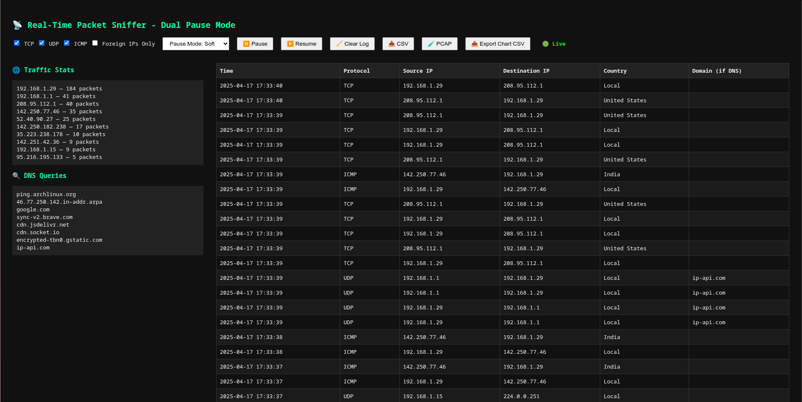

# 🕵️ Wireshark Lite — Real-Time Packet Sniffer

A fully custom-built packet sniffer (Wireshark Lite) made using **Python**, **Flask**, **Socket.IO**, and **Chart.js**. This tool provides a **real-time web interface** to monitor network traffic including protocol types, IP addresses, DNS lookups, and traffic rates.

---

## 🚀 Features

### ✅ Packet Capture & Protocol Detection
- Captures packets using raw sockets (`AF_PACKET`)
- Supports **TCP**, **UDP**, and **ICMP** protocols
- Filters out loopback (`127.0.0.1`) traffic

### ✅ Real-Time Web UI
- Live updating packet table (latest **100 packets** shown)
- Displays:
  - Timestamp
  - Protocol
  - Source IP
  - Destination IP
  - Country (via IP geolocation)
  - DNS (if available)
- Real-time **line chart** showing `packets/sec`
- Highlighted alerts for high traffic from a single IP

### ✅ UI Controls
- Protocol toggle checkboxes (TCP, UDP, ICMP)
- Filter: Foreign IPs Only
- Soft/Hard pause mode
- Live/Pause indicators
- Clear log button
- Export as CSV and PCAP

### ✅ Backend Capabilities
- Flask server with Socket.IO integration for real-time emit
- DNS query extraction using `dpkt`
- PCAP export via `dpkt.pcap.Writer`
- CSV logging of packets
- Country detection using `ip-api.com` (now cached with `ip_country_cache` to avoid repeated lookups)
- DNS query tracking
- Per-second packet rate emitter for live graphing
- Alerts when any IP crosses a threshold of `200 packets` in `10 seconds`

### ✅ Data Exports
- Download live-captured packets as:
  - CSV
  - PCAP
  - Chart data (`packets/sec`) as CSV

---

## 💻 Requirements

```bash
pip install flask flask-socketio dpkt requests
```

---

## 🔧 How to Run

Since raw sockets require elevated privileges, run the script with `sudo`:

```bash
sudo python3 packet_sniffer.py
```

The server runs at: `http://localhost:5000`

---

## 📁 Project Structure

```bash
.
├── packet_sniffer.py     # Main backend with socket and Flask logic
├── packet_log.csv        # CSV log of captured packets
├── packet_log.pcap       # PCAP log for Wireshark compatibility
├── templates/
│   └── index.html        # Frontend HTML (Web UI)
└── README.md             # You are here :)
```

---

## 🧠 How it Works

1. `packet_sniffer.py` uses a raw socket to listen to all packets on the network interface.
2. Packets are parsed for IP headers and protocol info.
3. If it's a UDP DNS packet, the domain is extracted using `dpkt.dns.DNS`.
4. Source IPs are geolocated using `ip-api.com`, but results are cached to prevent repeat lookups.
5. Packets are streamed to the frontend using Socket.IO.
6. The web UI dynamically updates table and chart with incoming data.

---

## 🌐 Web Interface Overview

| Section            | Description                             |
|-------------------|-----------------------------------------|
| 📄 Packet Table    | Shows latest 100 captured packets       |
| 📈 Traffic Graph   | Packets per second with zoom control    |
| ⚙️ Controls         | Pause, Clear, Download, Filter by proto |
| 🌍 Country Column  | Uses IP geolocation (cached)            |
| 🔍 DNS Query Box   | Shows recent domain queries             |

---

## 📦 Future Improvements (Ideas)
- Interface selector (`eth0`, `wlan0`, `lo`, etc.)
- Protocol breakdown by %
- Domain ↔ IP map viewer
- Persistent logging with SQLite

---

## 📸 Screenshot (Optional)



<br>


---

## 🙌 Credits
- Built with ❤️ using Python, Flask, dpkt, and JavaScript
- Geolocation via [ip-api.com](http://ip-api.com)
- Charting powered by [Chart.js](https://www.chartjs.org/)

---

## 🛡 Disclaimer
This tool is intended for educational and ethical use only. Use it responsibly and only on networks you own or have explicit permission to monitor.

---

Happy sniffing 🕵️‍♂️📡
